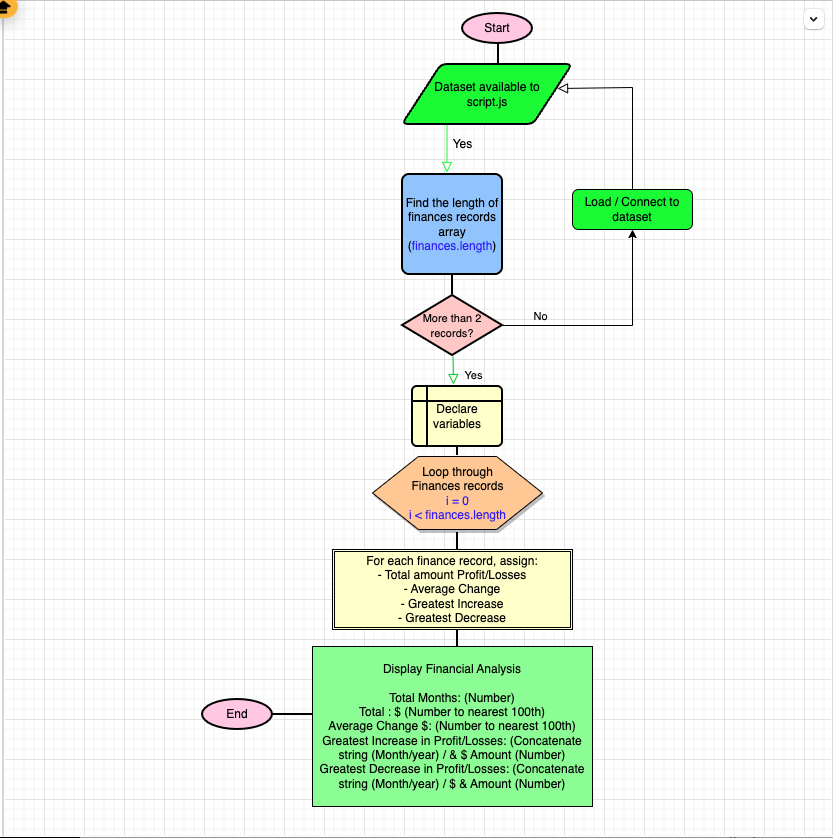

# Console-Finances

Work to - Create a code for analysing the financial records of a company.
Languages used:

HTML
JavaScript

Wireframe tool used:
drawio

Resources:
W3School
ChatGPT
Xpert Learning Assistant

Installation:
Installation An end user will only need to access the page via their browser using the following URL: " " A developer who wishes to access the back-end files for this page will need to: 1- have access to github Account to be able to open the repo via the following link : " "

2- Access to VSCode or similar tool to see the code and be able to modify if needed Usage Only needed a browser and the provided URL for the page above to be able to use the site live

CREDITS:
    https://chat.openai.com/
    Xpert Learning Assistant
    W3School

# Pseudocode:

## 1- Understand the requirements:

- Console Finances - Create a code for analysing the financial records of a company.

## 2- Break down the requirements into smaller requirements:

- Find the total number of months included in the provided dataset.
- Find the net total amount of Profit/Losses over the entire period.
- Find the average of the changes in Profit/Losses over the entire period.
	( Will need to track what the total change in profits is from month to month and then find the average. 
        (Total/(Number of months - 1))
- Find the greatest increase in profits (date and difference in the amounts) over the entire period.
- Find the greatest decrease in losses (date and difference in the amounts) over the entire period.

### Outcome:

When code opens in the browser console, the resulting analysis should look similar to the following:

Final code should print the analysis to the console.

### Note :
* Remember, in order to combine strings and variables in the console, I will need to use concatenation.
* CREDIT TO ChatGPT  'How do I only print to the nearest 100th in JavaScript?'

## 3- Writing the pseudocode:

Step: 1 : Declare values to finances Variable's array and assign to const (finances)
Step 2 : Create a main Function to contain looping through each record of the finances array and assign values after each loop step calculations
Step 3: Verify that array holds at least 2 records to perform calculations.
Step 4: Declare variables that will be used to display results in console
Step 5: Initiate a ‘for’ loop that will set i=0 , then if i < the length of the array
              // then increment i values by one. 
              // Then add the finance i record (that is the value of profit or loss) and then assign it to var (totalProfitLoss)
Step 6: for each i (finance record in the array), do assign the values of that finance record minus
              // the values of the finance record before it and assign the values to a variable monthlyChange
              // and add this new monthlyChange to the existing totalChange values
Step 7: Check if monthlyChange is greater than the current values of the first record listed under ProfitLoss. If it is, then assign month & year as well as ‘profiltLoss’ from the current monthlyChange values to the variable ‘greateastIncrease’
Step 8: Check if monthlyChange is less than the current values of the first record listed under ProfitLoss. If it is, then assign month & year as well as ‘profiltLoss’ from the current monthlyChange values to the variable ‘greateastIncrease’
Step 9: Log in the averageChange new values by dividing the ‘toalChange ‘values by the current number of the finances months array
Step 10: assign the rounding up the number to the nearest 100th to a rounded variable

## 4- Translating the pseudocode into an actual JS code:

Work in progress ….

# Flowchart:
CREDIT TO CHATGPT: How to insert image into a README.ME file in Github Repo



    

